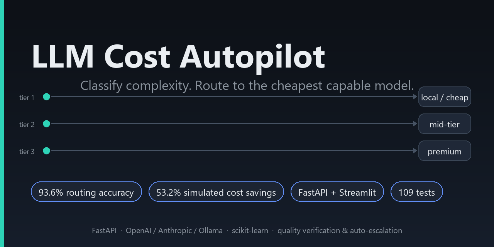

# LLM Cost Autopilot



[](https://github.com/ayushman-X-ai/LLM-Cost-Autopilot/actions/workflows/ci.yml)
[](https://github.com/ayushman-X-ai/LLM-Cost-Autopilot/actions/workflows/evaluate.yml)
[](LICENSE)

A production-style intelligent LLM routing layer that classifies request complexity, routes to the least-cost capable model, verifies quality (fast async or blocking quality mode), auto-escalates failures, falls back across providers on outages, and exposes cost/quality analytics.

> Portfolio project based on **Project 2 — LLM Cost Autopilot** from the supplied BASWE AI Engineering Projects Guide. The guide specifies multi-provider routing, a complexity classifier, async quality verification, auto-escalation, SQLite/JSON audit logs, dashboarding, FastAPI endpoints, Docker, and load testing.

## What this repository contains

- FastAPI OpenAI-compatible-ish `/v1/completions` endpoint with two verification modes
  - `fast`: return immediately, verify asynchronously in the background
  - `quality`: verify before returning; failed answers are re-run on a premium model and the corrected answer is returned
- Provider adapters for OpenAI, Anthropic, and Ollama with timeouts and retry-with-backoff
- Fallback routing: when the routed model times out or errors after retries, the request walks a per-tier fallback chain and reports `routing_event`, `original_model`, `fallback_model` and `reason`
- Configurable model registry with **real per-token pricing** and a `pricing_updated_at` timestamp
- Feature-based complexity classifier (TF-IDF word + char n-grams + engineered numeric features + Logistic Regression, evaluated with stratified 5-fold cross-validation)
- Curated training set (222 unique prompts, tier-balanced, with hand-written boundary cases; see [Measured routing quality](#measured-routing-quality)) plus a held-out 500-prompt routing evaluation set (`data/routing_eval.jsonl`) and a hand-written boundary/look-alike stress set (`data/routing_eval_boundary.jsonl`)
- Weighted quality scoring: correctness 40% / relevance 20% / completeness 20% / instruction following 20%, plus an agreement threshold
- Routing policy in YAML: tier → model, fallback chain, thresholds, quality weights, baseline model
- Async verification queue and auto-escalation to a stronger model
- **Routing-failure feedback loop**: failed verifications become candidate training examples (`data/routing_failures.jsonl`) for `python -m autopilot.cli retrain`
- **Routing evaluation CLI**: accuracy, per-tier precision/recall/F1, confusion matrix, tier accuracy, routing error rate (`data/evaluation_results.jsonl`)
- **Versioned routing configuration** persisted in SQLite: `GET/PUT /v1/routing-config`, `/history`, `/rollback` — changes survive restarts
- SQLite audit trail + structured JSON logs
- Streamlit dashboard with the headline metric as the hero section: actual cost vs premium baseline, savings, cost reduction %
- Benchmark CLI producing a cost / latency / quality comparison table for every model
- Load-test CLI for 500–1,000 request experiments with a full report (latency percentiles, baseline vs routed cost, escalation rate, quality pass rate)
- Synthetic load-test generator, Docker Compose, GitHub Actions CI
- **101 automated tests** covering routing, verification, escalation, fallback, budget guards, config versioning, DB, API and concurrency
- Architecture and interview documentation

## Important

This is a complete runnable **starter implementation**, not a claim that real API costs/quality are already benchmarked. Provider prices and model IDs change: prices live in `config/models.yaml` with a `pricing_updated_at` field per model and were checked against provider pricing pages on 2026-09-22 (the retired `claude-3-5-*-latest` IDs were replaced with `claude-haiku-4-5` / `claude-sonnet-5`). Re-verify before publishing measured savings. The training set was expanded with hand-written prompts (labels drafted, marked `reviewed: false`) and should be human-reviewed before you present it as a hand-curated production golden set. The 500-prompt evaluation set is template-generated with labels assigned by construction; cost figures in `artifacts/` are from **simulated dry-run** requests, not live provider calls.

## Measured routing quality

Measured on the held-out 500-prompt set (`data/routing_eval.jsonl`, untouched during development — no eval rows were added to training; a disjointness test in `tests/test_dataset.py` enforces this). The "before" row is the original starter classifier trained on the original dataset.

| Eval set | Model version | Accuracy | tier_1 | tier_2 | tier_3 |
|---|---|---|---|---|---|
| 500-prompt held-out | starter (72 unique training texts) | 76.6% | 97.9% | 49.7% | 82.4% |
| 500-prompt held-out | current (222 curated texts, improved features) | **93.6%** | 96.9% | 86.2% | 99.2% |
| 53-prompt boundary/look-alike set | current | **81.1%** | 76.5% | 87.0% | 76.9% |

- The original 76.6% was dominated by tier_2 → tier_1 confusion (79 of 181 tier_2 prompts mis-routed): the starter dataset repeated 72 unique texts, so the model memorized templates instead of learning complexity. The fix was dataset quality (deduplication + curated expansion with boundary cases) and features, not touching the eval set.
- The boundary set (`data/routing_eval_boundary.jsonl`, built by `scripts/build_boundary_eval.py`) is deliberately adversarial — tier_1 vs tier_2 and tier_2 vs tier_3 look-alikes plus rows flagged ambiguous for human review — so its lower score is the expected stress-test result, not a regression.
- **Known limitation:** residual errors concentrate on the tier_2 ↔ tier_3 boundary (multi-part drafting vs full design tasks). Confidence is exposed per request in `routing_reason` for downstream gating.
- Training-set cross-validation (stratified 5-fold): 80.2% — reported instead of the meaningless ~100% fit accuracy. Full metrics: `artifacts/complexity_classifier.json`.

Reproduce:

```bash
python -m autopilot.cli train
python -m autopilot.cli evaluate                                              # 500-prompt held-out set
python -m autopilot.cli evaluate --dataset data/routing_eval_boundary.jsonl   # boundary stress set
```

## Dry-run benchmark (simulated)

With `DRY_RUN=true` (no API keys needed), simulated requests are billed at registry prices with input-scaled usage, so the *relative* economics are representative while absolute numbers are not real provider costs:

```bash
DRY_RUN=true uvicorn autopilot.api:app --port 8000
# in a second terminal:
DRY_RUN=true python scripts/benchmark.py --limit 5 --no-judge   # per-model cost/latency table
DRY_RUN=true python scripts/load_test.py --requests 500 --concurrency 20
```

Latest simulated 500-request run (`artifacts/load_test_report.txt`): 500/500 successful, tier distribution 168/167/165, **53.2% cost reduction** vs the premium baseline (`openai_high`), 0% escalations, quality parity 100%. Treat these as methodology validation — publish live-provider numbers only after re-verifying prices in `config/models.yaml`.

## Quick start

### 1. Clone and enter

```bash
git clone <your-repo-url>
cd llm-cost-autopilot
```

### 2. Create environment

Python 3.11+ is recommended.

```bash
python -m venv .venv
# Windows PowerShell
.venv\Scripts\Activate.ps1
# macOS/Linux
# source .venv/bin/activate
pip install -r requirements.txt
```

### 3. Configure environment

```bash
copy .env.example .env
```

Set at least one provider key in `.env` if you want cloud inference. Ollama can run locally without a cloud API key.

### 4. Train and evaluate the classifier

```bash
python -m autopilot.cli train
python -m autopilot.cli evaluate     # accuracy, per-tier metrics, confusion matrix
```

### 5. Start API

```bash
uvicorn autopilot.api:app --reload --port 8000
```

OpenAPI docs: `http://localhost:8000/docs`

### 6. Start dashboard

```bash
streamlit run dashboard/app.py
```

### 7. Example requests

```bash
# fast mode (default): returns immediately, verifies in the background
curl -X POST http://localhost:8000/v1/completions ^
  -H "Content-Type: application/json" ^
  -d "{\"messages\":[{\"role\":\"user\",\"content\":\"Rewrite this sentence in a professional tone: Hey, can you send me that report?\"}]}"

# quality mode: verifies before returning, escalates on failure
curl -X POST http://localhost:8000/v1/completions ^
  -H "Content-Type: application/json" ^
  -d "{\"messages\":[{\"role\":\"user\",\"content\":\"Design a multi-tenant gateway with budgets and retries.\"}],\"verification_mode\":\"quality\"}"
```

On macOS/Linux, use the same JSON with normal shell quoting.

## Architecture

```text
Client
  |
  v
FastAPI ------------------------ verification_mode: fast | quality
  |                                        |
  v                                        v
Feature extraction -> ML classifier -> routing policy (tier -> primary + fallbacks)
                                          |
                        +-----------------+------------------+
                        |                 |                  |
                     TIER 1            TIER 2             TIER 3
                        |                 |                  |
                     cheap             medium             premium
                        +-----------------+------------------+
                                          |
                                          v
                          provider adapter (timeout + retry)
                                          |
                     +--------------------+--------------------+
                     | retry exhausted / cloud disabled /       |
                     | over budget -> next fallback in chain    |
                     | (routing_event: provider_failure,        |
                     |  cloud_disabled, cost_guard)             |
                     v
              immediate response
                     |
        +------------+-------------+
        | fast mode                | quality mode
        v                          v
  return response          verifier (weighted 4-dimension score)
        |                          |
        v                     PASS ----------> return
  background verifier             |
        |                        FAIL
   PASS / FAIL                   v
        |                   premium escalation -> corrected answer
        v
  audit (SQLite) + feedback (routing_failures.jsonl)
        |                         |
        v                         v
   dashboard                 retrain CLI -> better routing
        |
        v
   evaluation (routing_eval.jsonl -> evaluation_results.jsonl)
```

## Production-minded design choices

1. Provider-specific SDKs are isolated behind `Provider` adapters, with timeouts and classified retryable errors (timeout/connection/429/5xx).
2. Every request receives a standardized `LLMResponse` containing usage, latency and cost computed from registry pricing.
3. The classifier is a replaceable component rather than embedded in the router; it is measured on a held-out eval set.
4. Routing rules — primary model, fallback chain, thresholds, quality weights — live in YAML so policy changes need no code edits.
5. Verification runs in a background worker (`fast`) or inline (`quality`), driven by a per-request choice.
6. Escalation is policy-driven and fully audited; failed verifications feed the retraining loop.
7. Cost is calculated from registry metadata with an explicit `pricing_updated_at`, making savings auditable.
8. The dashboard compares routed cost with the configured premium baseline (`metrics.baseline_model`).
9. Routing configuration is versioned in SQLite with history and rollback.
10. Provider failures degrade gracefully through a fallback chain instead of failing the request.

## Repository layout

```text
autopilot/
  api.py                 FastAPI service (modes, fallback, versioned config)
  cli.py                 CLI commands: train/evaluate/retrain/stats/failures
  config.py              typed configuration loader
  db.py                  SQLite persistence + schema migration + config versions
  evaluation.py          held-out routing evaluation (metrics + reports)
  feedback.py            routing-failure feedback loop (JSONL training records)
  logging_utils.py       structured JSON logging
  models.py              Pydantic/domain models
  providers.py           OpenAI/Anthropic/Ollama adapters + retry/backoff
  router.py              classifier + routing engine + fallback chain
  classifier.py          feature extraction/training/inference
  verifier.py            weighted quality verification + escalation
  metrics.py             cost/savings calculations
  worker.py              background verification worker
  settings.py            environment settings
config/
  models.yaml            provider/model registry with real pricing
  routing.yaml           tier -> model + fallbacks + verification + baseline
data/
  complexity_dataset.jsonl training set (222 unique: original + curated expansion, integrity-checked)
  routing_eval.jsonl      held-out evaluation set (500 prompts)
  routing_eval_boundary.jsonl hand-written boundary/look-alike stress set (53 rows)
  routing_failures.jsonl  feedback loop: failed verifications for retraining
  evaluation_results.jsonl one row per evaluation run (trend view)
artifacts/
  .gitkeep               trained model output + eval/benchmark reports go here
dashboard/
  app.py                 Streamlit dashboard with cost-savings hero
scripts/
  benchmark.py           cost / latency / quality comparison across models
  build_routing_eval.py  deterministic eval-set generator
  build_boundary_eval.py boundary/look-alike eval-set builder (hand-written rows)
  expand_dataset.py      curated training-set expansion with integrity checks
  load_test.py           500-1,000 request experiment + full report
  seed_db.py             seed helper
  inspect_logs.py        log inspection helper
tests/
  ...                    109 unit/integration tests
Dockerfile
docker-compose.yml
requirements.txt
.env.example
.github/workflows/ci.yml
```

## Provider setup

### Ollama

Install Ollama separately and pull a model:

```bash
ollama pull llama3.2:3b
```

Then set `OLLAMA_BASE_URL=http://host.docker.internal:11434` for Docker or `http://localhost:11434` locally.

### OpenAI / Anthropic

Put the appropriate API keys in `.env`. Exact model IDs and prices are configurable in `config/models.yaml`; each model carries `pricing_updated_at` — update them against the providers' current documentation before benchmarking.

## API endpoints

- `POST /v1/completions` — route and execute a request; accepts `verification_mode: "fast" | "quality"`
  - response includes `quality_score`, `verified`, `escalated`, `routing_event`, `original_model`, `fallback_model`, `reason`
- `GET /v1/models` — configured model registry (with pricing and `pricing_updated_at`)
- `GET /v1/stats` — cost/quality/latency statistics, token totals, tier and model distributions
- `GET /v1/health` — health check
- `GET /v1/routing-config` — active config (latest persisted version, or YAML default)
- `PUT /v1/routing-config?created_by=alice` — persist a new config version (survives restarts)
- `GET /v1/routing-config/history` — version history with configs
- `POST /v1/routing-config/rollback` — `{"version": N}` restores an earlier config as a new version

## CLI

```bash
python -m autopilot.cli train                    # train classifier (CV metrics reported)
python -m autopilot.cli evaluate                 # held-out routing eval -> report + results JSONL
python -m autopilot.cli evaluate --dataset data/routing_eval_boundary.jsonl   # boundary stress set
python -m autopilot.cli retrain                  # retrain including routing_failures.jsonl
python -m autopilot.cli retrain --skip-failures  # ignore feedback rows
python -m autopilot.cli stats                    # audit statistics
python -m autopilot.cli failures                 # feedback-loop summary
python scripts/expand_dataset.py                 # idempotent curated dataset expansion + integrity checks
```

## Testing

```bash
pytest -q
```

109 tests cover: classifier features/training/CV metrics, dataset integrity (deduplication, balance, train/eval disjointness), routing and fallback chains, model registry pricing, cost calculation, budget protection (402), provider failure/timeout/retry, malformed verifier responses, verification scoring and thresholds, escalation, database + schema migration, API modes, routing-config versioning, Ollama/cloud-disabled fallback, concurrency, and the feedback/retrain loop.

CI runs `train`, `evaluate` (accuracy and confusion matrix on every push) and `pytest`. A separate scheduled workflow (`.github/workflows/evaluate.yml`) runs weekly and on manual dispatch: train → evaluate → retrain with feedback rows → upload the evaluation reports as artifacts, so routing quality is tracked over time.

## Benchmarking

Sends identical prompts to every configured model and records cost, latency and LLM-judged quality:

```bash
python scripts/benchmark.py --limit 5            # with quality judging
python scripts/benchmark.py --limit 5 --no-judge
```

Writes `artifacts/benchmark_report.md` (markdown comparison table) and `artifacts/benchmark.json`.

## Load test

Start the API first, then:

```bash
python scripts/load_test.py --requests 1000 --concurrency 20
python scripts/load_test.py --requests 500 --verification-mode quality
```

Writes `artifacts/load_test_report.txt` / `.json` with success/failure counts, avg/P50/P95/P99 latency, baseline vs routed cost and savings, escalation rate, **quality parity** (share of verified requests at/above the quality threshold), and tier/model distributions. This is a lightweight local experiment, not a substitute for a production load-testing tool.

## Portfolio demo

A strong 3–4 minute demo should show:

1. A simple prompt routed to a low-cost model.
2. A complex prompt routed to a premium model.
3. The same request in `quality` mode: verifier score, then an escalation that returns the corrected answer.
4. A provider failure (kill the local model or block the key) falling back down the chain with `routing_event: provider_failure`.
5. The dashboard hero: actual vs baseline cost, saved, cost reduction %.
6. `python -m autopilot.cli evaluate` confusion matrix / per-tier metrics.
7. A `PUT /v1/routing-config` change, a restart, and the config still active — plus rollback from history.
8. `python -m autopilot.cli retrain` picking up accumulated routing failures.

## Safety and cost controls

- The project never hardcodes API keys.
- `DRY_RUN=true` prevents external calls and is useful for tests.
- `MAX_REQUEST_COST_USD` is a configurable per-request budget guard; when the routed model exceeds it, routing falls back to an affordable candidate (`routing_event: cost_guard`) or rejects with 402.
- Verification can be disabled with `VERIFICATION_ENABLED=false`, or chosen per request via `verification_mode`.
- Set `ALLOW_CLOUD=false` to permit only local Ollama models (cloud candidates are skipped or rejected with 403).
- `PROVIDER_TIMEOUT_SECONDS` and `PROVIDER_MAX_ATTEMPTS` control timeout and retry behaviour.

## License

MIT — see `LICENSE`.
